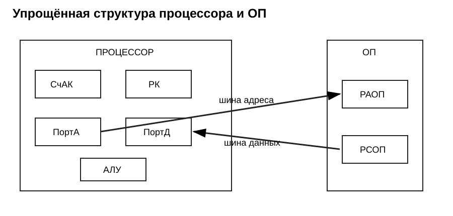
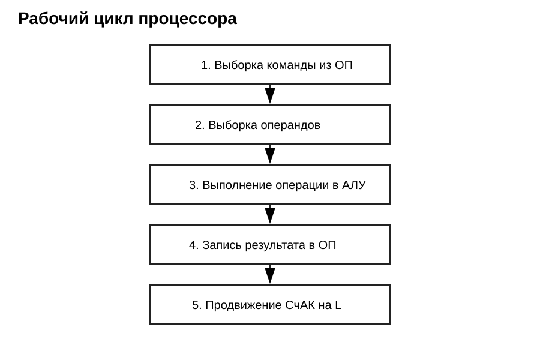
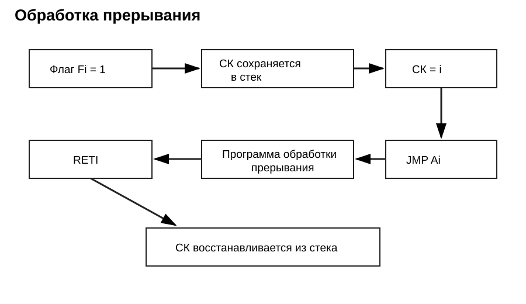

# Взаимодействие устройств ЭВМ при выполнении машинной команды

Конспект по презентации **«Взаимодействие устройств ЭВМ в процессе выполнения машинной команды (рабочий цикл процессора)»**.

## 1. Программа, команды и данные

Программа — последовательность действий (команд), направленная на преобразование входных данных в результат. Команды и данные выполняемой программы хранятся в оперативной памяти (ОП), а команды выполняет процессор.

Данные в ЭВМ представлены в двоичном виде. Числа хранятся в двоичной системе счисления, символы — своими двоичными кодами, логические векторы — последовательностями битов.

**Команда** — приказ компьютеру выполнить определённую операцию. Для двухадресной команды в ней можно выделить код операции (КОП) и адреса двух операндов A1 и A2. Результат обычно помещается в память на место первого операнда.

## 2. Основные устройства и регистры

В рассматриваемой схеме используются:

- **РК** — регистр команд, хранит выбранную команду во время её выполнения;
- **СчАК** — счётчик адреса команды, содержит адрес очередной команды;
- **ПортА** — порт адреса, связанный с шиной адреса;
- **ПортД** — порт данных, связанный с шиной данных;
- **Р1** — аккумулятор АЛУ;
- **Р2** — второй регистр АЛУ;
- **РАОП** — регистр адреса оперативной памяти;
- **РСОП** — регистр слова оперативной памяти;
- **УУиС** — устройство управления и синхронизации;
- **DC** — дешифратор кода операции.

Для чтения из ОП процессор выставляет адрес на шину адреса и формирует сигнал **ЧтОП**. Данные появляются в РСОП и по шине данных поступают в ПортД. Для записи процессор выставляет адрес, данные и формирует сигнал **ЗпОП**.

## 3. Рабочий цикл процессора

Для двухадресной арифметической или логической команды рабочий цикл разбит на пять основных этапов.

### Этап 1. Выборка команды

Последовательность микродействий:

1. **ПортА := СчАК** — адрес команды выставляется на шину адреса.
2. **ЧтОП** — команда считывается из оперативной памяти.
3. **РК := ПортД** — считанная команда помещается в регистр команд.

РК хранит команду всё время её выполнения.

### Этап 2. Выборка операндов

Первый операнд:

1. **ПортА := A1**
2. **ЧтОП**
3. **Р1 := ПортД**

Второй операнд:

1. **ПортА := A2**
2. **ЧтОП**
3. **Р2 := ПортД**

Таким образом, оба операнда оказываются в регистрах АЛУ.

### Этап 3. Выполнение операции в АЛУ

Часть РК, содержащая КОП, поступает на дешифратор DC. На соответствующем выходе формируется осведомительный сигнал. УУиС по нему выдаёт управляющий сигнал АЛУ, который запускает микропрограмму нужной операции.

Результат операции помещается в аккумулятор **Р1**.

### Этап 4. Запись результата

В рассмотренном варианте результат записывается на место первого операнда:

1. **ПортД := Р1**
2. **ПортА := A1**
3. **ЗпОП**

### Этап 5. Продвижение счётчика команд

После выполнения команды:

**СчАК := СчАК + L**

где **L** — длина выполненной команды в байтах. После этого СчАК указывает на следующую команду.

## 4. Повторение рабочего цикла

После включения УУиС устанавливает СчАК на начальный адрес программы. Далее процессор циклически выполняет выборку команды, выборку операндов, операцию, запись результата и переход к следующей команде.

При выполнении примера сложения процессор сначала получает команду из ОП, затем два операнда, выполняет сложение в АЛУ, записывает результат вместо первого операнда и увеличивает счётчик команд на длину команды.

## 5. Признак результата и флаги

В уточнённой схеме АЛУ формируются признаки результата. В презентации указаны:

- ШАЛУ(0)=1, если Р1 = 0;
- ШАЛУ(1)=1, если Р1 < 0;
- ШАЛУ(2)=1, если Р1 > 0;
- ШАЛУ(3)=1 при переполнении с фиксированной точкой.

Также предусмотрены флаги исключительных ситуаций: переполнение порядка, исчезновение порядка, потеря значимости и деление на ноль.

Признак результата сохраняется в **РПР**, а флаги исключительных ситуаций — в **РФ** для последующего анализа системой прерываний.

## 6. Команды перехода

Обычная арифметическая команда заканчивается продвижением СчАК, поэтому выполняется следующая по порядку команда. Для разветвлений и циклов применяются **команды передачи управления**.

В презентации рассматривается условный переход по маске. Команда содержит КОП, поле маски **M** и адрес перехода **A**. Если маска или адрес равны нулю, переход не выполняется. Если в M все единицы — переход безусловный. При совпадении признака результата с условием маски в СчАК записывается адрес A.

## 7. Прерывания

Прерывания позволяют временно переключить процессор с выполняемой программы на программу обработки события. В презентации рассматриваются исключения, возникающие при выполнении команд, и прерывания от внешних устройств.

Для поддержки прерываний используются регистр флагов **РФ**, регистр масок **РМ** и указатель стека **УС**.

В памяти первые слова отводятся под **таблицу векторов прерываний (ТВП)**. В соответствующем слове находится команда безусловного перехода на начало программы обработки прерывания.

При обнаружении Fi=1 процессор:

1. сохраняет текущий СК в стеке: **ОП[УС] = СК**;
2. увеличивает УС;
3. загружает в СК номер соответствующего слова ТВП: **СК = i**;
4. выполняет находящуюся там команду **JMP Ai**;
5. выполняет программу обработки прерывания;
6. по команде **RETI** уменьшает УС и восстанавливает СК из стека.

После этого выполнение прерванной программы продолжается с сохранённого адреса.

## Краткий итог

Работа процессора строится как постоянно повторяющийся рабочий цикл: **выбрать команду → получить операнды → выполнить операцию → сохранить результат → перейти к следующей команде**. УУиС координирует устройства процессора, СчАК определяет адрес следующей команды, РК хранит текущую команду, АЛУ выполняет операцию, а обмен с ОП идёт через шины адреса и данных. Команды перехода изменяют обычную последовательность выполнения, а система прерываний позволяет временно переключаться на обработку внешних и внутренних событий.
